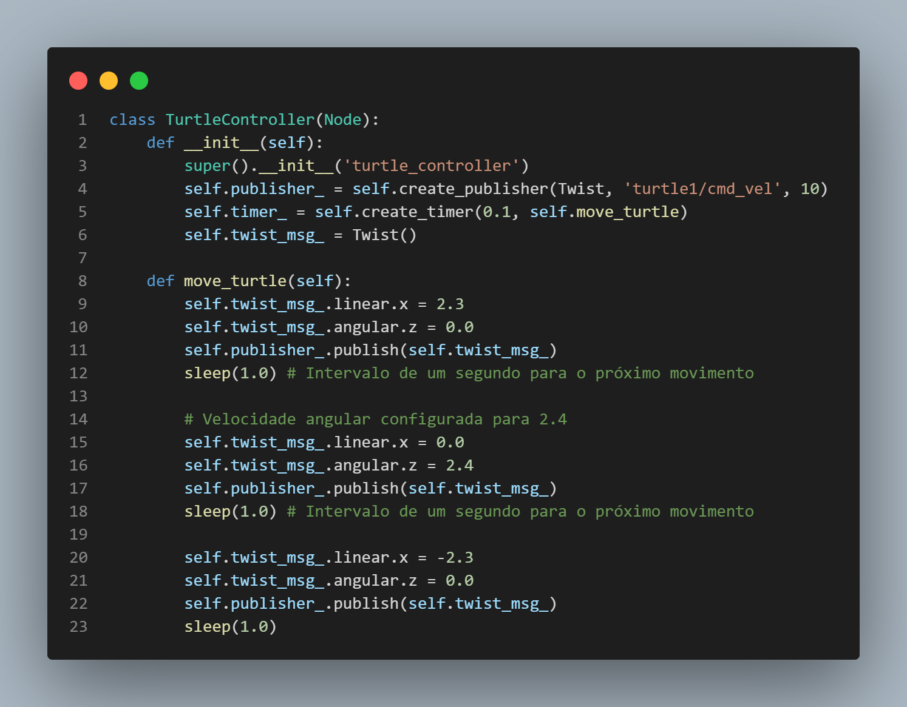
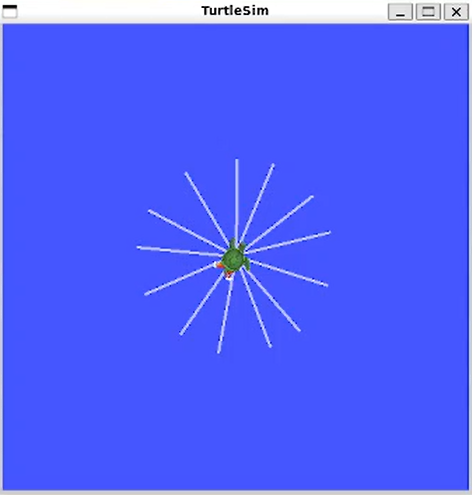

# Atividade 1: Turtlesim: simulando um ambiente robótico integrado no ROS

## Enunciado

Crie um script em Python capaz de interagir com o nó de simulação do turtlesim e enviar mensagens nos tópicos que regem a locomoção da tartaruga principal. Utilize este script para reproduzir um desenho de sua autoria. Utilize a estrutura de dados que preferir para representar a “imagem” a ser desenhada. O uso de programação orientada a objetos é obrigatório.

## Setup do ambiente 

Após seguir os mesmos passos dado no exemplo, instalando o WLS, o ROS 2 HUMBLE e executando o comando a seguir:

```bash
pip install -r requirements.txt
```

Primeiramente instancie o turtlesim, usando o codigo:

```bash
ros2 run turtlesim turtlesim_node
```

Logo em seguida rode o arquivo python:

```bash
python3 entrega.py
```

## Codigo

Nas primeiras linhas do código importamos as bibiliotecas necessárias. O método "sleep" da biblioteca "time" nos permite fazer com que a tartaruga espere os segundos definidos antes de executar as p´roximas linhas de código

```powershell
from time import sleep
import rclpy
from rclpy.node import Node
from geometry_msgs.msg import Twist
```

A classe 'TurtleController' é a principal desse código e dentro dela há 2 funções. A primeira é a <code>init</code> que seta algumas configurações iniciais para a simulação, como definir o envio de informações Twist via o publisher. Também está setado um timer que irá invocar o <code>move_turtle</code> a cada 0.1s. 



Já nessa função. A <code>move_turtle</code> mudamos os parâmetros de velocidade linear e angular para definir o trajeto da tartaruga. Nessa simulação formamos diversos angulos de aproximadamente 135°, onde a tartaruga vai e retorna ao ponto central, formando um circulo raiado a partir do centro.



No final a função 'main' irá rodar a função, iniciando a interface entre o script e o ROS. No final a rede ROS é interrompida.

```
def main(args=None):
    rclpy.init()
    turtle_controller = TurtleController()
    rclpy.spin(turtle_controller)
    turtle_controller.destroy_node()
    rclpy.shutdown()
```