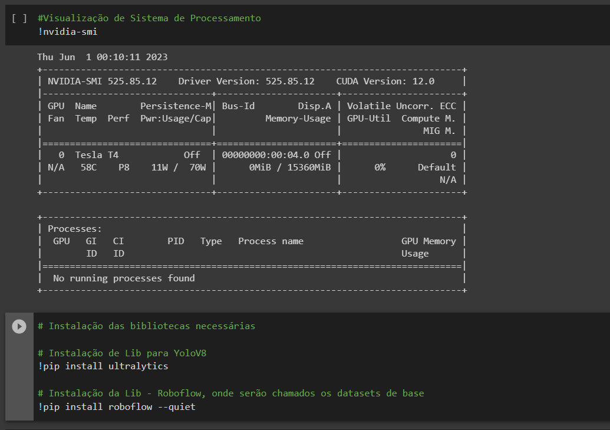

# Detectando plantas doentes usando Visão Computacional - Ponderada 3 

O projeto a seguir usa a biblioteca YoLov8 e o dataset [_Plants Diseases Detection Model_](https://universe.roboflow.com/final-year-project-zorqg/plants-diseases-detection-model/dataset/8), disponibilizado em [_Roboflow_](roboflow.com), para a avaliação de plantas doentes

Assista o video na pasta _media_ acima para visualizar o colab final!

## Colab
Iniciamos esse colab conferindo se estamos com a GPU habilitada, isso diminui significativamente o tempo de treinamento do modelo, caso esteja desabilitado, devemos ativar em _editar > configuraões de notebook > acelerador de hardware > GPU_.
Em seguida, instalamos as bibliotecas necessárias

Na sequencia, importamos as libs para o colab e definimos a varivel **HOME** como o diretório onde o python está sendo executado.

Neste mesmo diretório é criado a pasta dataset e nela fazemos o download do dataset de _Detecção de doenças de plantas_, além de definir nossa API da Roboflow

Aqui retornamos ao diretório **HOME** e treinamos nosso modelo. Nesse caso eu usei 6 épocas para agilizar o tempo de treinamento ao mesmo tempo que não perdemos tanta precisão na detecção.

Abaixo é a imagem da matrix de confusão do nosso modelo.

Conjunto de predição de imagens para treino

Usando o YoLo rodamos o código abaixo validar as imagens e logo depois predizer

Printamos os resultados das imagens internas ao próprio Dataset

E aqui usamos as imagens externas ao Dataset, retiradas do Google Images

