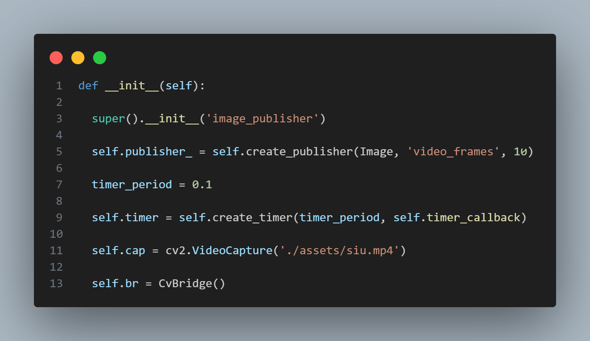

# Sistema de Visão computacional

## Passo a passo

### Supabase

Primeiramente devemos criar nosso projeto no Supabase, isso possibilitará a criação dos "buckets"
Para que nossa aplicaçõa tenha acesso ao nosso _storage_ do Supabase devemos salvar a URL do Projeto e sua _service role_, usaremos ela mais tarde no código

Devemos autorizar o acesso ao nosso Bucket definindo as ações possiveis nele, através das _policies_

### Publisher

Esse código tem como objetivo, ler todos os frames do video que é passado em `__init__` na classe `ImagePublisher()`, fazer a conversão entre _opencv_ e _ros_ e publica-lo no tópico `video_frames`

### Subscriber

Aqui, nos inscrevmos no topico `video_frames` para receber todas enviadas para lá. Depois convertemos esses frames do tipo _ROS Image_ para _opencv_ armazenamos localmente na nossa pasta _recebidos_ através da rota de backend `/upload`.

### Main

Em nosso `main.py` passamos nossa a _url_ e _service role_ do nosso bucket e definimos todas nossas rotas

Ao acessarmos a rota `/images` do tipo _POST_, ela enviará para o supabase, no bucket que definimos, todos os arquivos de imagens que armazenamos localmente.
Para conferir se nossos arquivos foram realmente enviados, podemos acessar a rota `/list` que listará todas nossos arquivos que estão no bucket ou acessa-lo via a plataforma online do supabase

